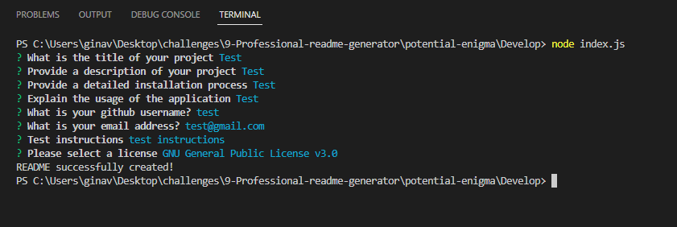

# This is a test

# Description

baby daddy

# Table of Contents

- [Installation](#installation)
- [Usage](#usage)
- [Credits](#credits)
- [Contributing](#contributing)
- [Tests](#tests)
- [Questions](#questions)
- [License](#license)

# Installation
My baby is cute

# Usage

Baby diapers are the worst

# Credits
- 
- 

# Contributing
another test

# Tests
test 1

# Questions
Link to my github profile [Github](https://github.com/babybooggers/)
If you have any questions, you can reach me via email at baby@gmail.com

# License

            
            GNU License

This is the GNU Lesser General Public License, version 3, which was released by the Free Software Foundation in 2007. The license allows users to copy and distribute the licensed software, but modifications to the software must also be released under the same license. The license also includes specific provisions for libraries and their use in applications or combined works, as well as exceptions to certain provisions in the GNU General Public License. 
            
            Released under MIT License

Copyright (c) 2013 Mark Otto.
Copyright (c) 2017 Andrew Fong.
Permission is hereby granted, free of charge, to any person obtaining a copy of this software and associated documentation files (the "Software"), to deal in the Software without restriction, including without limitation the rights to use, copy, modify, merge, publish, distribute, sublicense, and/or sell copies of the Software, and to permit persons to whom the Software is furnished to do so, subject to the following conditions:
The above copyright notice and this permission notice shall be included in all copies or substantial portions of the Software.
THE SOFTWARE IS PROVIDED "AS IS", WITHOUT WARRANTY OF ANY KIND, EXPRESS OR IMPLIED, INCLUDING BUT NOT LIMITED TO THE WARRANTIES OF MERCHANTABILITY, FITNESS FOR A PARTICULAR PURPOSE AND NONINFRINGEMENT. IN NO EVENT SHALL THE AUTHORS OR COPYRIGHT HOLDERS BE LIABLE FOR ANY CLAIM, DAMAGES OR OTHER LIABILITY, WHETHER IN AN ACTION OF CONTRACT, TORT OR OTHERWISE, ARISING FROM, OUT OF OR IN CONNECTION WITH THE SOFTWARE OR THE USE OR OTHER DEALINGS IN THE SOFTWARE.

    