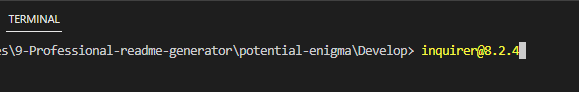

# Professional Readme

# Description

This application was built to design a Readme file. I wanted to apply my new knowledge of node.js to create a server application using the ES6 syntax in javascript. After this project I feel a little more comfortable using node.js

# Table of Contents

- [Installation](#installation)
- [Usage](#usage)
- [Credits](#credits)
- [Contributing](#contributing)
- [Tests](#tests)
- [Questions](#questions)
- [License](#license)

# Installation
To start running this project in a computer, the user needs to install node.js in their computer. In the browser search for a node version no lower than 16.19.1 and download it. Check if node.js was installed going to gitbash and typing "node", the terminal will show the version of node installed. Now open Visual Studio and in the terminal type nmp inquirer@8.2.4 to install the inquirer package that assists with the prompt questions that designs the readme file.

# Usage

This video shows an user going to the terminal and typing node index.js and then a series of questions appear in the terminal. A readme file is generated with the answers.

# Credits
- 
- 

# Contributing
Please send a pull request of your suggested fix/changes with descriptions, or please email me if you want to contribute to this project.

# Tests
After running node index.js, it is possible to use the console.log to test the readme generator, and check the type of data that is being entered.

# Questions
Link to my github profile [Github](https://github.com/ginitadavis/)
If you have any questions, you can reach me via email at gina.vera.davis@gmail.com

# License

            Apache License

The Apache License Version 2.0 is a license that governs the use, reproduction, and distribution of software. The license grants the user a perpetual, worldwide, non-exclusive, no-charge, royalty-free, irrevocable copyright license to reproduce, prepare derivative works of, publicly display, publicly perform, sublicense, and distribute the work and such derivative works in source or object form. Additionally, each contributor grants to the user a perpetual, worldwide, non-exclusive, no-charge, royalty-free, irrevocable (except as stated in the license) patent license to make, have made, use, offer to sell, sell, import, and otherwise transfer the work, where such license applies only to those patent claims licensable by such contributor that are necessarily infringed by their contribution(s) alone or by combination of their contribution(s) with the work to which such contribution(s) was submitted.
Users may reproduce and distribute copies of the work or derivative works thereof in any medium, with or without modifications, and in source or object form, provided that the following conditions are met: (1) any other recipients of the work or derivative works are given a copy of the license, (2) any modified files carry prominent notices stating that they were changed, (3) all copyright, patent, trademark, and attribution notices are retained in the source form of any derivative works that are distributed, excluding those notices that do not pertain to any part of the derivative works, and (4) if the work includes a "NOTICE" text file as part of its distribution, any derivative works that are distributed must include a readable copy of the attribution notices contained within such NOTICE file, excluding those notices that do not pertain to any part of the derivative works, in at least one of the following places: within a NOTICE text file distributed as part of the derivative works, within the source form or documentation if provided along with the derivative works, or within a display generated by the derivative works, if and wherever such third-party notices normally appear. The contents of the NOTICE file are for informational purposes only and do not modify the license. Users may add their own attribution notices within derivative works that they distribute, alongside or as an addendum to the NOTICE text from the work, provided that the additional attribution notices are clearly marked as such and do not imply a direct or indirect endorsement by the licensor of the derivative works.
            
            GNU License

This is the GNU Lesser General Public License, version 3, which was released by the Free Software Foundation in 2007. The license allows users to copy and distribute the licensed software, but modifications to the software must also be released under the same license. The license also includes specific provisions for libraries and their use in applications or combined works, as well as exceptions to certain provisions in the GNU General Public License. 
            
            MIT License

Copyright (c) 2013 Mark Otto.
Copyright (c) 2017 Andrew Fong.
Permission is hereby granted, free of charge, to any person obtaining a copy of this software and associated documentation files (the "Software"), to deal in the Software without restriction, including without limitation the rights to use, copy, modify, merge, publish, distribute, sublicense, and/or sell copies of the Software, and to permit persons to whom the Software is furnished to do so, subject to the following conditions:
The above copyright notice and this permission notice shall be included in all copies or substantial portions of the Software.
THE SOFTWARE IS PROVIDED "AS IS", WITHOUT WARRANTY OF ANY KIND, EXPRESS OR IMPLIED, INCLUDING BUT NOT LIMITED TO THE WARRANTIES OF MERCHANTABILITY, FITNESS FOR A PARTICULAR PURPOSE AND NONINFRINGEMENT. IN NO EVENT SHALL THE AUTHORS OR COPYRIGHT HOLDERS BE LIABLE FOR ANY CLAIM, DAMAGES OR OTHER LIABILITY, WHETHER IN AN ACTION OF CONTRACT, TORT OR OTHERWISE, ARISING FROM, OUT OF OR IN CONNECTION WITH THE SOFTWARE OR THE USE OR OTHER DEALINGS IN THE SOFTWARE.

    